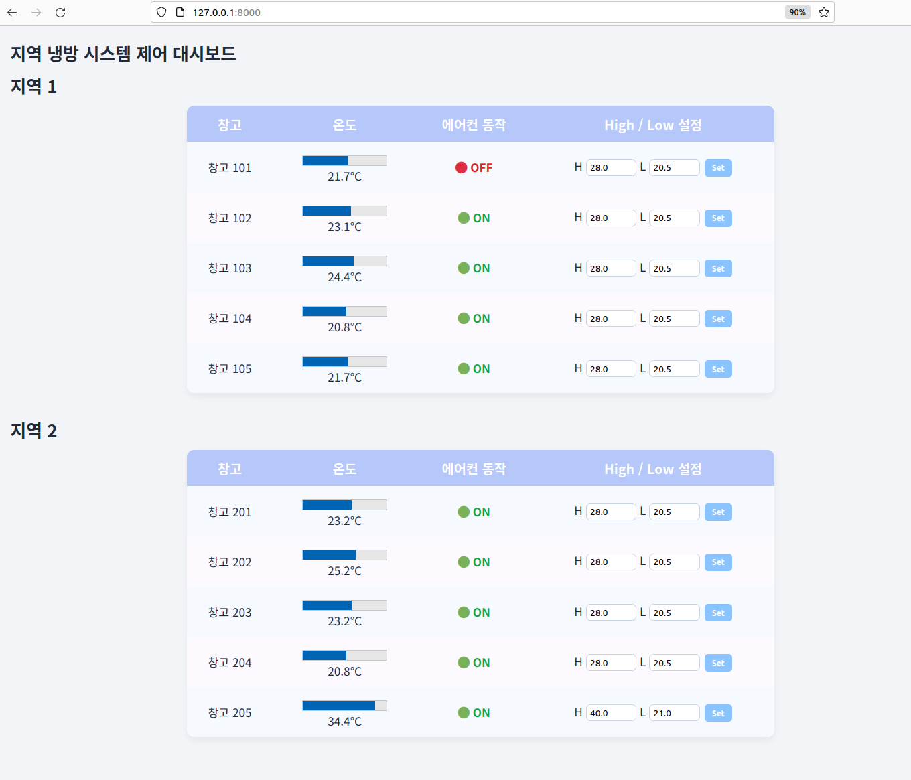

# pymodbus-test2

This project is based on MODBUS_PLC_Python_SCADA_Simulator.

Tested with Python 3.10 and pymodbus 3.9.2.

Please note: Due to an apparent indexing issue observed in pymodbus 3.9.2 (possibly a library-side bug), this implementation includes workarounds to handle or mitigate the behavior accordingly.

## 2 Key Files 
hvac_server: Very Simple Simulator + Modbus Slave(Server) 

hvac_client: Very Simple Weberver(Flask) + Modbus Master(Client)

Results

